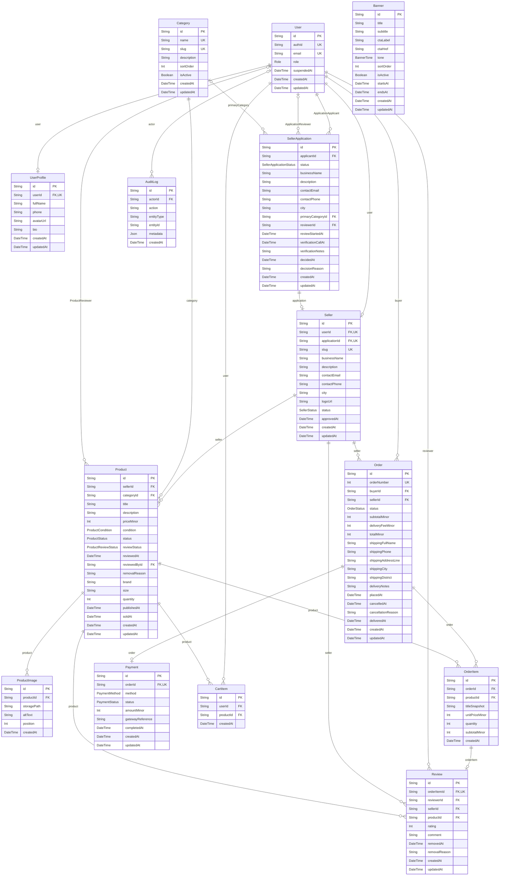

# Database diagram (ERD)

Every table in the Feri Nepal database and how they connect. GitHub draws the diagram below automatically. The source of truth is `packages/database/prisma/schema.prisma`.

How to read it: `PK` is the primary key, `FK` a link to another table, `UK` a value that must be unique. A line with `||` on one end means exactly one, `o|` means zero or one, and `o{` means zero or many. Money is stored in paisa (`priceMinor`, `totalMinor`). `AuditLog.entityId` points at different tables depending on `entityType`, so it is not a real foreign key.

## The main flows

- **Becoming a seller:** a `User` files a `SellerApplication`. When an admin approves it, a `Seller` is created from it.
- **Selling:** a `Seller` owns many `Product` rows. Each product belongs to one `Category` and has up to six `ProductImage` rows.
- **Buying:** a buyer's `CartItem` rows become one `Order` per seller. Each order has its `OrderItem` rows and one `Payment` (cash on delivery).
- **Reviews:** one `Review` per `OrderItem`, allowed after the order is delivered. Ratings are summed per `Seller`.
- **Housekeeping:** `Banner` feeds the home page carousel. `AuditLog` records who did what.
